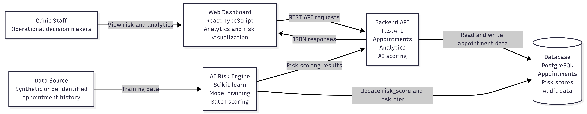

# AI Smart Appointment Optimizer

AI driven healthcare operations platform designed to reduce missed medical appointments, improve clinic scheduling efficiency, and support data informed operational decisions.

## Overview

Missed medical appointments create significant inefficiencies in healthcare delivery, leading to delayed care, wasted clinical capacity, and increased operational costs. AI Smart Appointment Optimizer addresses this challenge by combining analytics, machine learning, and visualization to help clinics proactively manage appointment risk and improve access to care.

The system predicts the likelihood of appointment no shows, assigns interpretable risk tiers, and provides analytics dashboards that surface actionable patterns for operational planning.

## Key Features

### Appointment Management

1. Centralized appointment data storage
2. Support for historical and upcoming appointments
3. Structured schema designed for operational analytics

### AI No Show Risk Prediction

1. Baseline machine learning model trained on appointment history
2. Risk score output between 0 and 1
3. Interpretable risk tiers Low Medium High
4. Features designed to be explainable for operational decision support

### Analytics and Insights

1. No show rate trend over time
2. No show patterns by day of week
3. Risk tier distribution across upcoming appointments

### Interactive Dashboard

1. React dashboard displaying analytics and recent appointments
2. Charts for trends and distributions
3. Table view showing predicted risk tier and risk score

## System Architecture

The platform is implemented as a decoupled system with a backend API and a frontend dashboard.

### Backend

1. REST API for appointments, analytics, seeding, and AI batch scoring
2. PostgreSQL database for persistent storage
3. Model training artifacts saved to the backend artifacts folder
4. Batch scoring updates upcoming appointments with risk fields

### Frontend

1. React TypeScript dashboard
2. Consumes backend APIs to display live data and charts

## Technology Stack

### Backend

1. Python
2. FastAPI
3. PostgreSQL
4. SQLAlchemy
5. Scikit learn
6. Pandas

### Frontend

1. React
2. TypeScript
3. Chart.js
4. React Chart.js 2

### Infrastructure and Tooling

1. Docker for local Postgres
2. Git and GitHub

## Quick Start

### Prerequisites

1. Docker Desktop
2. Python installed
3. Node.js installed

### Start Postgres

From the repo root:

1. cd infra
2. docker compose up -d

### Start Backend API

From the repo root:

1. cd backend
2. py -m venv .venv
3. .venv\Scripts\activate
4. pip install -r requirements.txt
5. py -m uvicorn app.main:app --reload --port 8000

Swagger docs:
[http://127.0.0.1:8000/docs](http://127.0.0.1:8000/docs)

### Seed Data

In Swagger, run:
POST /seed/appointments

### Train Model

From backend folder:
py -m app.ml.train_model

### Batch Score Upcoming Appointments

In Swagger, run:
POST /scoring/batch

### Start Frontend Dashboard

From the repo root:

1. cd frontend-ui
2. npm install
3. npm start

Dashboard:
[http://localhost:3000](http://localhost:3000)

## Screenshots

Screenshots showing backend APIs, AI scoring execution, and dashboard analytics are available in:
docs/screenshots

## Intended Use

This project is intended as a working prototype illustrating how analytics and machine learning can be applied to healthcare operations to reduce missed appointments and improve clinic utilization.

It is not intended for direct clinical decision making without validation using real world data and appropriate regulatory controls.

## Responsible AI Considerations

1. Uses interpretable features rather than opaque signals
2. Designed to support operational planning, not deny care
3. Requires validation and monitoring before real world deployment
4. Emphasizes transparency, limitations, and measurable outcomes

## Project Status

The project demonstrates an end to end AI workflow including data ingestion, model training, batch scoring, analytics reporting, and dashboard visualization.

## License

This project is provided as a technical prototype and reference implementation.
See the LICENSE file for usage and distribution terms.
